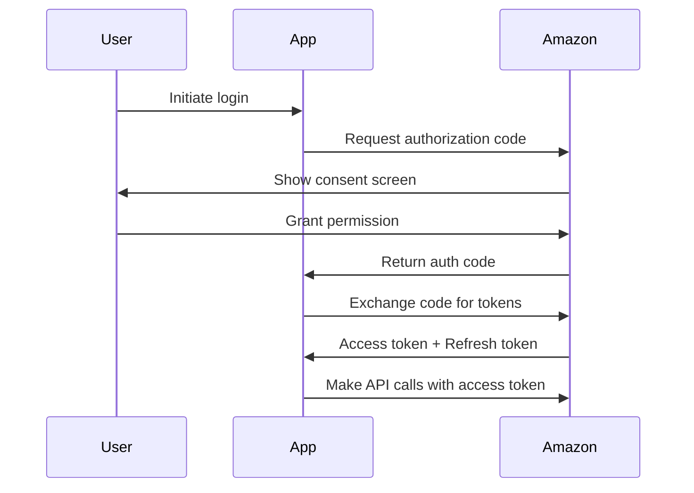
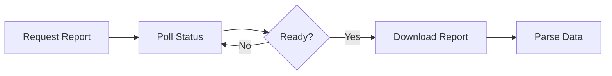

# Amazon Ads API - Core Concepts & Reference

## Table of Contents

1. [Authorization](#authorization)
2. [Reporting and Exports](#reporting-and-exports)
3. [Ad Library API](#ad-library-api)
4. [Postman Setup](#postman-setup)
5. [Compatibility and Versioning](#compatibility-and-versioning)
6. [Rate Limiting](#rate-limiting)
7. [Reference Tables](#reference-tables)

---

## Authorization

To use the Amazon Ads API, an application must be delegated access to act on behalf of an advertiser through an **OAuth 2.0 flow**. Tokens retrieved through this process are used for all operations in the API.

### Key Concepts

**Profile ID**: For most operations, API callers pass a profile identifier representing an advertiser's account in a particular marketplace.

**Headers Required**:

```
Authorization: Bearer {access_token}
Amazon-Advertising-API-ClientId: {client_id}
Amazon-Advertising-API-Scope: {profile_id}
```

### Authorization Flow



### Token Management

| Token Type | Duration | Purpose |
|------------|----------|---------|
| **Access Token** | 60 minutes | Authenticate API requests |
| **Refresh Token** | Long-lived | Generate new access tokens |

**Example Token Refresh**:

```typescript
async refreshAccessToken(refreshToken: string): Promise<TokenResponse> {
  const response = await fetch('https://api.amazon.com/auth/o2/token', {
    method: 'POST',
    headers: { 'Content-Type': 'application/x-www-form-urlencoded' },
    body: new URLSearchParams({
      grant_type: 'refresh_token',
      refresh_token: refreshToken,
      client_id: this.clientId,
      client_secret: this.clientSecret,
    }),
  });
  
  return response.json();
}
```

See the [Authorization Overview](https://advertising.amazon.com/API/docs/en-us/concepts/authorization) for complete details.

---

## Reporting and Exports

### Reporting API

Use the Ads API reporting functionality to retrieve **campaign performance data**.

**Key Features**:

- Asynchronous report generation
- Metrics: Impressions, Clicks, Spend, Sales, ACOS, ROAS, CTR, CVR
- Multiple report types: Campaign, Ad Group, Keyword, Product, Search Term
- Date range filtering
- Segmentation by time unit (Daily, Weekly, Monthly)

**Report Generation Flow**:



**Example Report Request**:

```typescript
// Step 1: Request report
const reportId = await requestCampaignReport({
  reportType: 'spCampaigns',
  metrics: ['impressions', 'clicks', 'cost', 'sales', 'acos', 'roas'],
  startDate: '2024-01-01',
  endDate: '2024-01-31',
});

// Step 2: Poll until ready
let status = 'IN_PROGRESS';
while (status === 'IN_PROGRESS') {
  const result = await getReportStatus(reportId);
  status = result.status;
  await sleep(30000); // Wait 30s
}

// Step 3: Download
const reportData = await downloadReport(reportId);
```

### Exports

Use exports to pull **current campaign metadata and structure** (not performance metrics).

**What You Can Export**:

- Campaign configurations
- Ad group settings
- Keyword lists
- Product targeting
- Bid strategies

**Difference from Reports**:

| Feature | Reports | Exports |
|---------|---------|---------|
| **Purpose** | Performance data | Structure/metadata |
| **Metrics** | Impressions, clicks, sales | Campaign names, budgets, states |
| **Time-based** | Yes (date ranges) | No (current snapshot) |
| **Use Case** | Analyze ROI | Bulk editing |

Learn more:

- [Reporting API](https://advertising.amazon.com/API/docs/en-us/guides/reporting)
- [Exports API](https://advertising.amazon.com/API/docs/en-us/guides/exports)

---

## Ad Library API

The **Ad Library API** provides the ability to query data related to advertisements and affiliate marketing content displayed on Amazon's European Union (EU) stores.

### Overview

- **Endpoint**: `http://advertising-api-eu.amazon.com`
- **Coverage**: Germany, Spain, France, Italy, Netherlands, Poland, Sweden, Belgium
- **Cost**: Free
- **Access**: Anyone can access with a developer account

### What You Can Query

- All ads displayed on EU stores
- Affiliate marketing content (Amazon Associates program):
  - Shoppable Photos
  - Idea Lists
  - Articles

### API Details

**Date Format**: ISO format (YYYY-MM-DD) in UTC timezone

**Result Limit**: Up to 1,000 results per request

**Pagination**: Use `nextToken` to retrieve additional results

### Example Use Cases

1. **Competitive Research**: See what ads competitors are running
2. **Trend Analysis**: Track advertising patterns over time
3. **Compliance Monitoring**: Verify ad content across marketplaces
4. **Affiliate Analysis**: Study successful affiliate marketing strategies

### Requirements

- Amazon developer account ([create here](https://www.developer.amazon.com/))
- Login with Amazon (LwA) security profile
- No additional API approval needed

---

## Postman Setup

Postman is a tool that allows developers to make API calls using a user interface. Amazon Ads provides a Postman collection for easy testing.

### Prerequisites

- Postman account or desktop application
- Completed API onboarding
- Generated access and refresh tokens

### Setup Steps

**1. Download Files**:

- [Postman Environment File](https://github.com/amzn/ads-api-postman-collection)
- [Postman Collection File](https://github.com/amzn/ads-api-postman-collection)

**2. Import to Postman**:

- Collections tab → Import → Select collection file
- Environments tab → Import → Select environment file

**3. Configure Environment**:

Navigate to **Environments → Amazon Ads API Environment** and set:

| Variable | Value | Description |
|----------|-------|-------------|
| `client_id` | Your Client ID | From LWA application |
| `client_secret` | Your Client Secret | From LWA application |
| `refresh_token` | Your Refresh Token | Generated during auth |
| `api_url` | Regional URL | Default: NA endpoint |

**Regional URLs**:

- North America: `https://advertising-api.amazon.com`
- Europe: `https://advertising-api-eu.amazon.com`
- Far East: `https://advertising-api-fe.amazon.com`

**4. Get Access Token**:

Open **POST Access token from refresh token** endpoint and send request.

> [!TIP]
> `token_expires_at` keeps track of when your token expires. Each time you make a call, Postman automatically refreshes the token if expired.

**5. Get Profile ID**:

Use **Profiles → GET Profiles** endpoint to retrieve your profile ID.

### Currently Supported Features

- ✅ Authentication
- ✅ Sponsored ads reporting
- ✅ Sponsored ads snapshots
- ✅ Test accounts
- ✅ Account management
- ✅ Amazon Marketing Stream
- ✅ Sponsored Products campaign management (version 3)
- ✅ Product metadata
- ✅ Sponsored Display (for non-Amazon sellers)
- ✅ Budget usage
- ✅ Budget rules
- ✅ Exports
- ✅ Partner opportunities

### Environment Variables Reference

| Variable | Description |
|----------|-------------|
| `client_id` | LWA application client ID |
| `client_secret` | LWA application client secret |
| `permission_scope` | Default: `advertising::campaign_management` |
| `redirect_uri` | Default: `https://amazon.com` |
| `access_token` | Auto-populated (valid 60 min) |
| `refresh_token` | Long-lived token for refreshing access |
| `token_expires_at` | Auto-tracked expiration timestamp |
| `profileId` | Your Amazon Ads profile ID |

### Next Steps

- [Make your first call](https://advertising.amazon.com/API/docs/en-us/get-started/make-your-first-call)
- [Request a report](https://advertising.amazon.com/API/docs/en-us/guides/reporting/request-report)
- [Create test account](https://advertising.amazon.com/API/docs/en-us/test-accounts)

---

## Compatibility and Versioning

REST resources in the Amazon Ads API are independently versioned using a **major.minor format** (e.g., "3.0").

### Versioning Policy

- **Backward Compatibility**: Resources are guaranteed to be backward compatible within a major version
- **Breaking Changes**: Only occur with major version increments
- **Current State**: Many resources have only one version

### Specifying Versions

Include version in the API path:

```
GET /sp/campaigns/v3
POST /reporting/reports/v2
```

### Deprecation Policy

1. **Advance Notice**: Minimum 90 days before deprecation
2. **Migration Guide**: Provided for all breaking changes
3. **Sunset Date**: Clearly communicated end-of-life date

Learn more: [Compatibility and Versioning](https://advertising.amazon.com/API/docs/en-us/concepts/compatibility-versioning)

---

## Rate Limiting

Rate limiting in the Amazon Ads API is **determined dynamically** based on overall system load.

### Best Practices

**1. Implement Exponential Backoff**:

```typescript
async function retryWithBackoff(fn: Function, maxRetries = 3) {
  for (let i = 0; i < maxRetries; i++) {
    try {
      return await fn();
    } catch (error) {
      if (error.status === 429 && i < maxRetries - 1) {
        const waitTime = Math.pow(2, i) * 1000; // 1s, 2s, 4s
        await sleep(waitTime);
      } else {
        throw error;
      }
    }
  }
}
```

**2. Batch Requests**:

- Use bulk operations instead of individual calls
- Maximum batch size: Varies by endpoint (typically 100-1000)

**3. Cache Responses**:

- Store campaign metadata locally
- Refresh only when needed
- Use exports for initial data load

**4. Respect 429 Responses**:
When you receive a `429 Too Many Requests`:

- Read the `Retry-After` header (seconds)
- Wait before retrying
- Consider reducing request frequency

**5. Use Async Report Generation**:
Instead of polling frequently:

```typescript
// ❌ Bad: Polling every second
while (status !== 'READY') {
  await sleep(1000);
  status = await checkStatus();
}

// ✅ Good: Polling every 30 seconds
while (status !== 'READY') {
  await sleep(30000);
  status = await checkStatus();
}
```

Learn more: [Rate Limiting](https://advertising.amazon.com/API/docs/en-us/concepts/rate-limiting)

---

## Reference Tables

### Limits and Constraints

See the following resources for detailed constraints:

- **[Service Limits](https://advertising.amazon.com/API/docs/en-us/reference/limits)**: API quotas and throughput limits
- **[Bid Constraints by Marketplace](https://advertising.amazon.com/API/docs/en-us/reference/bid-constraints)**: Min/max bid amounts per marketplace
- **[Valid Characters](https://advertising.amazon.com/API/docs/en-us/reference/valid-characters)**: Allowed characters in fields

### Character Constraints

**Keyword Text**:

- Length: 10-255 characters
- Allowed: Alphanumeric, spaces, hyphens
- Prohibited: Special characters, emojis

**Entity Names** (Campaigns, Ad Groups):

- Length: 1-128 characters
- Allowed: Alphanumeric, spaces, common punctuation
- Prohibited: Control characters

### Common Error Codes

| Code | Message | Meaning | Solution |
|------|---------|---------|----------|
| `401` | Unauthorized | Invalid/expired token | Refresh access token |
| `403` | Forbidden | Insufficient permissions | Check profile ID and scopes |
| `404` | Not Found | Entity doesn't exist | Verify IDs |
| `429` | Too Many Requests | Rate limit exceeded | Implement backoff |
| `500` | Internal Server Error | Amazon service issue | Retry after delay |

### Computed Status

Computed status reflects the **true operational state** of an entity, considering parent states.

**Example**:

- Campaign: `paused`
- Ad Group: `enabled`
- **Computed Status**: `paused` (inherits from parent)

Learn more: [Computed Status](https://advertising.amazon.com/API/docs/en-us/reference/computed-status)

---

## Additional Resources

- [API Overview](https://advertising.amazon.com/API/docs/en-us)
- [Getting Started](https://advertising.amazon.com/API/docs/en-us/get-started)
- [Developer Forums](https://advertising.amazon.com/API/forums)
- [Support](https://advertising.amazon.com/API/support)
