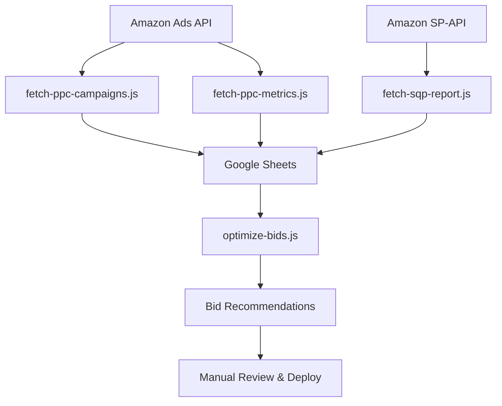

# 🎯 TITAN PPC OPTIMIZATION - GOOGLE SHEETS MASTER PLAN

## Executive Summary

This document provides the complete architecture for a **multi-layered Amazon PPC optimization system** using Google Sheets as the centralized data platform. The system implements **Chris Rawlings' 2026 VPC methodology**, automated bleeder detection, search query performance analysis, and real-time bid recommendations.

---

## 📊 ARCHITECTURE OVERVIEW

### System Components



### Data Flow Layers

| Layer | Purpose | Update Frequency |
|-------|---------|------------------|
| **Layer 1: Raw Data** | Campaign structure, performance metrics | Daily |
| **Layer 2: Calculations** | VPC, ACOS, ROAS, efficiency scores | Real-time (formulas) |
| **Layer 3: Analysis** | Bleeders, winners, opportunities | Real-time (formulas) |
| **Layer 4: Recommendations** | Bid adjustments, budget changes | On-demand |
| **Layer 5: Dashboard** | Visual summary, KPIs | Real-time (charts) |

---

## 📋 SHEET STRUCTURE DESIGN

### Sheet 1: `PPC Campaigns`

**Purpose**: Master campaign list with real-time performance data

#### Column Layout (A-Z, AA-AZ)

| Column | Field Name | Data Type | Source | Formula/Logic |
|--------|-----------|-----------|--------|---------------|
| **A** | Campaign Name | Text | API | Direct from campaigns API |
| **B** | State | Text | API | ENABLED/PAUSED/ARCHIVED |
| **C** | Targeting Type | Text | API | MANUAL/AUTO |
| **D** | Budget | Number | API | Daily budget in $ |
| **E** | Spend (30d) | Number | Metrics API | Sum of last 30 days |
| **F** | Sales (30d) | Number | Metrics API | Attributed sales |
| **G** | Impressions | Number | Metrics API | Total impressions |
| **H** | Clicks | Number | Metrics API | Total clicks |
| **I** | Orders | Number | Metrics API | Total orders |
| **J** | CTR | % | **FORMULA** | `=H/G` (Clicks/Impressions) |
| **K** | CPC | $ | **FORMULA** | `=E/H` (Spend/Clicks) |
| **L** | CVR | % | **FORMULA** | `=I/H` (Orders/Clicks) |
| **M** | ACOS | % | **FORMULA** | `=E/F` (Spend/Sales) |
| **N** | ROAS | Ratio | **FORMULA** | `=F/E` (Sales/Spend) |
| **O** | **VPC** | $ | **FORMULA** | `=F/H` (Sales/Clicks) - **Core Chris Rawlings Metric** |
| **P** | Target ACOS | % | Manual Input | User-defined acceptable ACOS |
| **Q** | Min VPC | $ | Manual Input | Minimum acceptable VPC threshold |
| **R** | **Is Bleeder** | Boolean | **FORMULA** | `=AND(E>0, M>P, O<Q)` |
| **S** | **Bleeder Severity** | Text | **FORMULA** | CRITICAL/HIGH/MEDIUM/LOW |
| **T** | **Efficiency Score** | Number | **FORMULA** | `=(N*100) + (IF(O>Q,1,0)*50)` |
| **U** | **Recommended Action** | Text | **FORMULA** | PAUSE/REDUCE_BID/INCREASE_BID/OPTIMIZE |
| **V** | **Suggested Bid Change** | $ | **FORMULA** | Based on VPC vs Target |
| **W** | Current Bid | $ | API | Current bid amount |
| **X** | **New Bid** | $ | **FORMULA** | `=W+V` |
| **Y** | Days Running | Number | **FORMULA** | Days since campaign start |
| **Z** | Last Updated | Timestamp | API | Last sync timestamp |

#### Key Formulas

**VPC (Value Per Click) - Column O**

```excel
=IFERROR(F2/H2, 0)
```

> **Logic**: Total sales divided by total clicks. This is the CORE metric in Chris Rawlings' 2026 methodology.

**Is Bleeder - Column R**

```excel
=AND(E2>0, M2>P2, O2<Q2, B2="ENABLED")
```

> **Logic**: A campaign is a "bleeder" if:
>
> 1. It's spending money (E2 > 0)
> 2. ACOS exceeds target (M2 > P2)
> 3. VPC is below minimum threshold (O2 < Q2)
> 4. It's currently enabled

**Bleeder Severity - Column S**

```excel
=IF(R2=FALSE, "NONE", 
  IF(AND(M2>P2*2, O2<Q2*0.5), "CRITICAL",
    IF(AND(M2>P2*1.5, O2<Q2*0.7), "HIGH",
      IF(M2>P2*1.2, "MEDIUM", "LOW"))))
```

> **Logic**: Severity tiers based on how far metrics deviate from targets

**Efficiency Score - Column T**

```excel
=(N2*100) + IF(O2>Q2, 50, 0) + IF(M2<P2, 30, 0) - IF(R2, 50, 0)
```

> **Logic**: Composite score rewarding high ROAS, good VPC, and low ACOS

**Recommended Action - Column U**

```excel
=IF(R2=TRUE, IF(S2="CRITICAL", "PAUSE", "REDUCE_BID"),
  IF(AND(M2<P2*0.8, O2>Q2*1.2), "INCREASE_BID",
    IF(T2>150, "WINNER - NO CHANGE", "OPTIMIZE")))
```

> **Logic**: Decision tree based on bleeder status and efficiency

**Suggested Bid Change - Column V**

```excel
=IF(U2="PAUSE", 0,
  IF(U2="REDUCE_BID", W2*-0.15,
    IF(U2="INCREASE_BID", W2*0.15, 0)))
```

> **Logic**: 15% reduction for bleeders, 15% increase for winners

---

### Sheet 2: `Search Query Performance`

**Purpose**: Track search term efficiency (Chris Rawlings "Sales Stealing" strategy)

#### Column Layout

| Column | Field Name | Source | Formula/Logic |
|--------|-----------|--------|---------------|
| **A** | Search Term | SP-API Brand Analytics | Direct |
| **B** | Search Volume | SP-API | Monthly searches |
| **C** | Brand Impressions | SP-API | Your ASINs shown |
| **D** | Brand Clicks | SP-API | Clicks on your ASINs |
| **E** | Brand Purchases | SP-API | Orders from term |
| **F** | Market Impressions | SP-API | Total market |
| **G** | Market Clicks | SP-API | Total market |
| **H** | Market Purchases | SP-API | Total market |
| **I** | **My CTR** | **FORMULA** | `=D2/C2` |
| **J** | **Market CTR** | **FORMULA** | `=G2/F2` |
| **K** | **CTR Gap** | **FORMULA** | `=(J2-I2)/J2` |
| **L** | **My CVR** | **FORMULA** | `=E2/D2` |
| **M** | **Market CVR** | **FORMULA** | `=H2/G2` |
| **N** | **CVR Advantage** | **FORMULA** | `=(L2-M2)/M2` |
| **O** | **Is Hidden Gem** | **FORMULA** | `=AND(B2>1000, L2>M2, I2<J2)` |
| **P** | **Potential Sales** | **FORMULA** | `=IF(O2, B2*(J2-I2)*L2, 0)` |
| **Q** | **Priority** | Text | HIGH/MEDIUM/LOW based on P |

#### Hidden Gem Logic (Chris Rawlings Strategy)

**Criteria for "Hidden Gem" - Column O**

```excel
=AND(
  B2>1000,           // High volume term
  L2>M2,             // Your CVR beats market
  I2<J2,             // Your CTR below market
  C2>0               // You're showing up
)
```

> **Logic**: You convert well but don't get enough clicks → Optimize main image/title

---

### Sheet 3: `Bid Recommendations`

**Purpose**: Automated bid suggestions generated by `optimize-bids.js`

#### Column Layout

| Column | Field Name | Source | Logic |
|--------|-----------|--------|-------|
| **A** | Campaign Name | Script | From analysis |
| **B** | Current Bid | Script | Current state |
| **C** | Recommended Bid | Script | VPC-based calculation |
| **D** | Change Amount | **FORMULA** | `=C2-B2` |
| **E** | Change % | **FORMULA** | `=D2/B2` |
| **F** | Reason | Script | Why this change |
| **G** | Expected Impact | Script | Predicted outcome |
| **H** | Status | Manual | PENDING/APPROVED/APPLIED |
| **I** | Applied Date | Manual | When deployed |

---

### Sheet 4: `Dashboard`

**Purpose**: Executive summary with visual KPIs

#### Metrics Section (A1:D20)

| Metric | Current | Target | Status |
|--------|---------|---------|--------|
| Total Active Campaigns | `=COUNTIF('PPC Campaigns'!B:B,"ENABLED")` | - | |
| Total Spend (30d) | `=SUM('PPC Campaigns'!E:E)` | - | |
| Total Sales (30d) | `=SUM('PPC Campaigns'!F:F)` | - | |
| Overall ACOS | `=Total Spend/Total Sales` | 25% | ✅/❌ |
| Overall ROAS | `=Total Sales/Total Spend` | 4.0 | ✅/❌ |
| **Avg VPC** | `=AVERAGE('PPC Campaigns'!O:O)` | $15 | ✅/❌ |
| Active Bleeders | `=COUNTIF('PPC Campaigns'!R:R,TRUE)` | 0 | ❌ |
| Critical Bleeders | `=COUNTIF('PPC Campaigns'!S:S,"CRITICAL")` | 0 | ❌ |
| Winners (Score >150) | `=COUNTIFS('PPC Campaigns'!T:T,">150",'PPC Campaigns'!B:B,"ENABLED")` | - | |

#### Charts Section

1. **Spend by Campaign Type** (Pie Chart)
   - Auto vs Manual campaigns

2. **VPC Distribution** (Histogram)
   - Show VPC across all campaigns

3. **Bleeder Funnel** (Bar Chart)
   - CRITICAL → HIGH → MEDIUM → LOW

4. **Top 10 Winners** (Horizontal Bar)
   - Campaigns with highest efficiency scores

5. **Hidden Gems Opportunities** (Table)
   - From Search Query Performance sheet

---

### Sheet 5: `Configuration`

**Purpose**: Global settings and thresholds

| Setting | Value | Description |
|---------|-------|-------------|
| Target ACOS | 25% | Acceptable advertising cost |
| Min VPC | $12 | Minimum value per click |
| Max Bid | $3.50 | Bid ceiling for safety |
| Min Bid | $0.10 | Bid floor |
| Bid Adjustment Step | 15% | Default bid change increment |
| Bleeder Threshold Days | 7 | Days before flagging |
| Hidden Gem Volume | 1000 | Min search volume for SQP |

---

## 🔧 IMPLEMENTATION STEPS

### Phase 1: Sheet Structure Setup (Manual - 30 min)

#### Step 1.1: Create New Google Sheet

1. Go to Google Sheets
2. Create new spreadsheet: "Titan PPC Optimization"
3. Note the Spreadsheet ID from URL
4. Update `.env` with `GOOGLE_SHEETS_ID`

#### Step 1.2: Create Tabs

Create 5 tabs with exact names:

- `PPC Campaigns`
- `Search Query Performance`
- `Bid Recommendations`
- `Dashboard`
- `Configuration`

#### Step 1.3: Setup Headers (Row 1)

**PPC Campaigns Sheet - Row 1:**

```
A1: Campaign Name
B1: State
C1: Targeting
D1: Budget
E1: Spend (30d)
F1: Sales (30d)
G1: Impressions
H1: Clicks
I1: Orders
J1: CTR
K1: CPC
L1: CVR
M1: ACOS
N1: ROAS
O1: VPC
P1: Target ACOS
Q1: Min VPC
R1: Is Bleeder
S1: Severity
T1: Efficiency
U1: Action
V1: Bid Change
W1: Current Bid
X1: New Bid
Y1: Days Running
Z1: Last Updated
```

**Configuration Sheet:**

```
A1: Setting
B1: Value
C1: Description
```

Then populate rows 2-9 with the settings from table above.

#### Step 1.4: Add Formulas (Rows 2+)

**PPC Campaigns - Row 2 formulas** (copy down to row 1000):

```excel
J2: =IFERROR(H2/G2, 0)                           // CTR
K2: =IFERROR(E2/H2, 0)                           // CPC
L2: =IFERROR(I2/H2, 0)                           // CVR
M2: =IFERROR(E2/F2, 0)                           // ACOS
N2: =IFERROR(F2/E2, 0)                           // ROAS
O2: =IFERROR(F2/H2, 0)                           // VPC
R2: =AND(E2>0, M2>P2, O2<Q2, B2="ENABLED")      // Is Bleeder
S2: =IF(R2=FALSE,"NONE",IF(AND(M2>P2*2,O2<Q2*0.5),"CRITICAL",IF(AND(M2>P2*1.5,O2<Q2*0.7),"HIGH",IF(M2>P2*1.2,"MEDIUM","LOW"))))  // Severity
T2: =(N2*100)+IF(O2>Q2,50,0)+IF(M2<P2,30,0)-IF(R2,50,0)  // Efficiency
U2: =IF(R2=TRUE,IF(S2="CRITICAL","PAUSE","REDUCE_BID"),IF(AND(M2<P2*0.8,O2>Q2*1.2),"INCREASE_BID",IF(T2>150,"WINNER","OPTIMIZE")))  // Action
V2: =IF(U2="PAUSE",0,IF(U2="REDUCE_BID",W2*-0.15,IF(U2="INCREASE_BID",W2*0.15,0)))  // Bid Change
X2: =W2+V2                                       // New Bid
```

#### Step 1.5: Default Values (Rows 2+)

Set default values for manual input columns:

```
P2-P1000: 0.25    // Target ACOS (25%)
Q2-Q1000: 12      // Min VPC ($12)
```

#### Step 1.6: Formatting

**Headers (Row 1)**:

- Font: Bold, 11pt, White text
- Background: Dark blue (#1a73e8)
- Border: All borders, black

**Data Rows**:

- Freeze row 1 (View → Freeze → 1 row)
- Auto-resize all columns
- Number formats:
  - Columns E,F,K,O,Q,V,W,X: Currency ($0.00)
  - Columns J,L,M,P: Percentage (0.00%)
  - Column N: Number (0.00)

**Conditional Formatting**:

1. **Bleeder Highlight** (Column R):
   - Range: R2:R1000
   - Condition: Cell value = TRUE
   - Format: Red background, white text

2. **Severity Colors** (Column S):
   - CRITICAL: Dark red background
   - HIGH: Orange background
   - MEDIUM: Yellow background
   - LOW: Light yellow background
   - NONE: Green background

3. **Efficiency Score** (Column T):
   - >150: Dark green
   - 100-150: Light green
   - 50-100: Orange
   - <50: Red

---

### Phase 2: Data Scripts Update

#### Step 2.1: Update `fetch-ppc-campaigns.js`

**Change sync target from A11 to A2** (write immediately after headers):

```javascript
// In syncToSheets() method:
await this.sheets.clearRange(sheetName, 'A2:Z1000');  // Clear data, not headers
await this.sheets.writeRows(sheetName, rows, 'A2');    // Write starting row 2
```

**Update row mapping** to include manual columns:

```javascript
const rows = campaigns.map(c => [
    c.name,                     // A: Campaign Name
    c.state,                    // B: State
    c.targetingType,            // C: Targeting
    c.budget?.budget || 0,      // D: Budget
    0,                          // E: Spend (from metrics)
    0,                          // F: Sales (from metrics)
    0,                          // G: Impressions
    0,                          // H: Clicks
    0,                          // I: Orders
    // J-O: Formulas
    '',                         // P: Target ACOS (manual)
    '',                         // Q: Min VPC (manual)
    // R-V: Formulas
    0,                          // W: Current Bid (from API)
    // X: Formula
    '',                         // Y: Days Running (formula later)
    new Date().toISOString()    // Z: Last Updated
]);
```

#### Step 2.2: Create `fetch-ppc-metrics.js`

**Purpose**: Fetch performance data and UPDATE existing campaign rows

```javascript
// Key logic:
// 1. Read existing campaigns from Sheet
// 2. Fetch metrics from Reporting API
// 3. Match by campaign name
// 4. UPDATE columns E-I with metrics
// 5. Preserve formulas in J-V
```

**Implementation needed** (separate script to write).

#### Step 2.3: Update `analyze-sqp-csv.js`

**Sync results to "Search Query Performance" sheet**:

```javascript
async syncToSheets(hiddenGems) {
    const headers = [['Search Term', 'Volume', 'Brand Impr', 'Brand Clicks', ...]]
    await this.sheets.writeRows('Search Query Performance', headers, 'A1');
    
    const rows = hiddenGems.map(gem => [
        gem.searchTerm,
        gem.searchQueryVolume,
        gem.brandImpressions,
        // ... all columns
    ]);
    
    await this.sheets.writeRows('Search Query Performance', rows, 'A2');
}
```

---

### Phase 3: Dashboard Setup

#### Step 3.1: Create KPI Cards (A1:D20)

Use formulas referencing `PPC Campaigns` sheet:

```excel
A2: Total Active
B2: =COUNTIF('PPC Campaigns'!B:B,"ENABLED")

A3: Total Spend
B3: =SUM('PPC Campaigns'!E:E)
C3: (Target - leave blank)
D3: =IF(B3>0,"✅","")

A4: Total Sales
B4: =SUM('PPC Campaigns'!F:F)

A5: Overall ACOS
B5: =IF(B4>0,B3/B4,0)
C5: 25%
D5: =IF(B5<C5,"✅","❌")

A6: Overall ROAS
B6: =IF(B3>0,B4/B3,0)
C6: 4.0
D6: =IF(B6>C6,"✅","❌")

A7: Avg VPC
B7: =AVERAGE('PPC Campaigns'!O:O)
C7: $12.00
D7: =IF(B7>C7,"✅","❌")

A8: Active Bleeders
B8: =COUNTIF('PPC Campaigns'!R:R,TRUE)
C8: 0
D8: =IF(B8=0,"✅","❌")
```

#### Step 3.2: Add Charts

**Chart 1: Bleeder Severity (F2:K12)**

- Type: Pie chart
- Data range: `'PPC Campaigns'!S:S`
- Title: "Campaign Health Distribution"

**Chart 2: VPC Distribution (F14:K24)**

- Type: Histogram
- Data range: `'PPC Campaigns'!O:O`
- Bins: 10
- Title: "Value Per Click Distribution"

**Chart 3: Top 10 Winners (F26:K36)**

- Type: Horizontal bar
- Data: Top 10 by Efficiency Score
- Sort descending

---

### Phase 4: Automation

#### Step 4.1: Create Daily Sync Script

**`sync-daily.sh` (or .bat for Windows):**

```bash
#!/bin/bash
echo "🔄 Starting daily PPC sync..."

# Step 1: Fetch campaigns
node fetch-ppc-campaigns.js
if [ $? -ne 0 ]; then
    echo "❌ Campaign fetch failed"
    exit 1
fi

# Step 2: Fetch metrics
node fetch-ppc-metrics.js
if [ $? -ne 0 ]; then
    echo "❌ Metrics fetch failed"
    exit 1
fi

# Step 3: Search query performance (weekly only)
if [ $(date +%u) -eq 1 ]; then
    echo "📊 Weekly: Analyzing search queries..."
    node analyze-sqp-csv.js
fi

echo "✅ Daily sync complete!"
```

#### Step 4.2: Schedule Automation

**Windows Task Scheduler:**

- Trigger: Daily at 6 AM
- Action: Run `sync-daily.bat`

**Linux Cron:**

```cron
0 6 * * * cd /path/to/project && ./sync-daily.sh
```

---

## 🎓 OPTIMIZATION STRATEGIES DOCUMENTATION

### Strategy 1: VPC-Based Bid Optimization (Chris Rawlings 2026)

**What is VPC?**
Value Per Click = Sales / Clicks

**Why It Matters:**

- More accurate than ACOS for profitability
- Accounts for click quality, not just cost
- Directly correlates with profit margin

**Decision Tree:**

```
IF VPC > Target VPC AND ACOS < Target ACOS:
    → INCREASE BID (15%)
    → Reasoning: Profitable clicks, can afford more traffic

ELSE IF VPC > Target VPC BUT ACOS > Target ACOS:
    → NO CHANGE
    → Reasoning: Good conversion, but too expensive

ELSE IF VPC < Target VPC AND ACOS > Target ACOS:
    → REDUCE BID (15%) or PAUSE
    → Reasoning: BLEEDER - unprofitable on both metrics

ELSE IF VPC < Target VPC AND ACOS < Target ACOS:
    → OPTIMIZE LISTING
    → Reasoning: Cheap clicks but low conversion → improve product page
```

### Strategy 2: Bleeder Detection & Severity Levels

**Bleeder Criteria:**

1. Spending money (Spend > $0)
2. ACOS above target
3. VPC below minimum threshold
4. Currently enabled

**Severity Calculation:**

| Severity | ACOS Condition | VPC Condition | Action |
|----------|---------------|---------------|--------|
| CRITICAL | >2x Target | <50% Min VPC | **PAUSE IMMEDIATELY** |
| HIGH | >1.5x Target | <70% Min VPC | Reduce bid 25% |
| MEDIUM | >1.2x Target | <90% Min VPC | Reduce bid 15% |
| LOW | >Target | <Min VPC | Monitor & reduce 10% |

### Strategy 3: Sales Stealing (Search Query Performance)

**Hidden Gem Criteria:**

1. **High Volume**: Search term has >1000 searches/month
2. **Good Conversion**: Your CVR > Market CVR
3. **Low Visibility**: Your CTR < Market CTR
4. **Showing**: You have impressions

**Root Cause:**
Product is converting well (good CVR) but not getting clicks (low CTR) → Poor main image or title

**Action:**

1. Analyze top competitor main images for this term
2. Update your main image to match top performer style
3. Add search term to first 80 chars of title
4. Re-measure after 7 days

**Expected Impact:**

```
Potential Sales = Search Volume × (Market CTR - My CTR) × My CVR
```

---

## 📈 SUCCESS METRICS

### Week 1 Targets

- [ ] All campaigns synced to sheet
- [ ] Formulas calculating correctly
- [ ] Manual Target ACOS/VPC configured
- [ ] Dashboard showing live data

### Week 2 Targets

- [ ] Performance metrics updating daily
- [ ] Identified all bleeders
- [ ] Applied first round of bid recommendations
- [ ] Paused CRITICAL bleeders

### Month 1 Targets

- [ ] Overall ACOS < 25%
- [ ] Overall ROAS > 4.0
- [ ] Avg VPC > $12
- [ ] Zero CRITICAL bleeders
- [ ] <5 HIGH severity bleeders

### Month 3 Targets

- [ ] Overall ACOS < 20%
- [ ] Overall ROAS > 5.0
- [ ] 80% campaigns are "WINNERS" (Efficiency >150)
- [ ] Implemented 5+ hidden gem opportunities

---

## 🔐 SECURITY & PERMISSIONS

### Google Sheets Permissions

- Service account must have Editor access
- Share sheet with: `GOOGLE_SERVICE_ACCOUNT_EMAIL`

### API Credentials Safety

- Never commit `.env` to git
- Rotate Amazon API tokens quarterly
- Monitor API usage for anomalies

---

## 🚀 DEPLOYMENT CHECKLIST

### Pre-Launch

- [ ] Google Sheet created with correct ID
- [ ] All 5 tabs created with exact names
- [ ] Headers added to row 1
- [ ] Formulas added to row 2 (copied to 1000)
- [ ] Default values set for Target ACOS, Min VPC
- [ ] Conditional formatting applied
- [ ] Service account has sheet access
- [ ] `.env` updated with sheet ID

### Launch

- [ ] Run `node fetch-ppc-campaigns.js`
- [ ] Verify data appears in row 2+
- [ ] Check formulas calculate correctly
- [ ] Verify dashboard KPIs update
- [ ] Run `node fetch-ppc-metrics.js` (once created)
- [ ] Confirm metrics populate

### Post-Launch

- [ ] Schedule daily automation
- [ ] Document manual review process
- [ ] Train team on bid recommendations
- [ ] Set up alerts for critical bleeders

---

## 📞 SUPPORT & MAINTENANCE

### Daily Tasks

- Review dashboard for red flags
- Check for new CRITICAL bleeders
- Apply approved bid recommendations

### Weekly Tasks

- Analyze hidden gem opportunities
- Review overall ACOS trend
- Adjust target thresholds if needed

### Monthly Tasks

- Full campaign audit
- Budget reallocation
- Strategy refinement based on data

---

## 🎯 CONCLUSION

This Google Sheets architecture provides:
✅ **Real-time visibility** into campaign performance  
✅ **Automated calculations** for VPC, bleeders, efficiency  
✅ **Actionable recommendations** for bid optimization  
✅ **Multi-strategy analysis** (VPC, bleeders, search queries)  
✅ **Scalable foundation** for ongoing optimization  

**Next Step**: Review this plan, then proceed with Phase 1 implementation.
